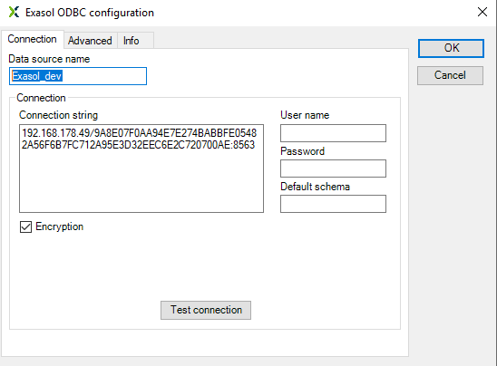
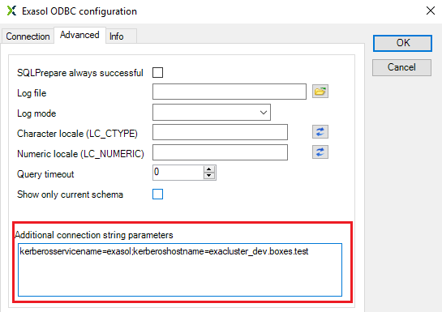
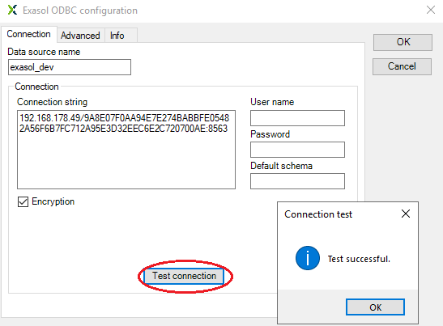

# Setting up ODBC DSN for Kerberos authentication to Exasol
## Prerequisites
* Exasol DB is configured to use Kerberos for user authentication
* OS user is able to get appropriate kerberos tgt-ticket to authenticate in Exasol DB
* Corresponding DB user is created which is identified by the OS user's kerberos principal. This DB user has a privilege to create sessions. For example:
```sql
create user ad_john_smith identified by KERBEROS PRINCIPAL 'jsmith@BOXES.TEST';
GRANT CREATE SESSION TO ad_john_smith;
```
* Connection was successfully tested with **exaplus -k**. Service name and Host name of the Exasol DB Kerberos principal are known.


## 1. Install latest Exasol ODBC driver
* Download and install the latest version of Exasol ODBC driver here https://downloads.exasol.com/clients-and-drivers/odbc

## 2. Configure new DSN
* Run **ODBC Data Source Administrator** and add a new User or System DSN. Select the previously installed **EXASolution Driver** and click **Finish**


* Enter the data source name. In the field **connection string** enter a full connection string with fingerprints and port. Leave **user** and **password** empty.



* Go to **Advanced** tab. In the field **Aditional connection string parameters** type service name and Host name of the Exasol DB Kerberos principal are known in the following format (without spaces):
```
kerberosservicename=<service name>;kerberoshostname=<host name>
```
> **kerberosservicename** : The service name of the Exasol DB Kerberos principal. Same as **Service name** parameter in **Exaplus -k**  \
> **kerberoshostname** : The host name of the Exasol DB Kerberos principal. Same as **Host** parameter in **Exaplus -k** 



* Go back to **Connection** tab and press **Test connection**. If the connection test is successful, click "Ok" and finish DSN creation.


