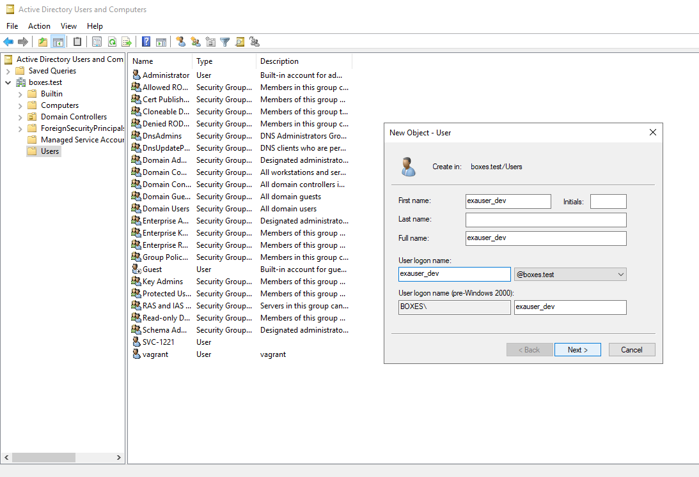
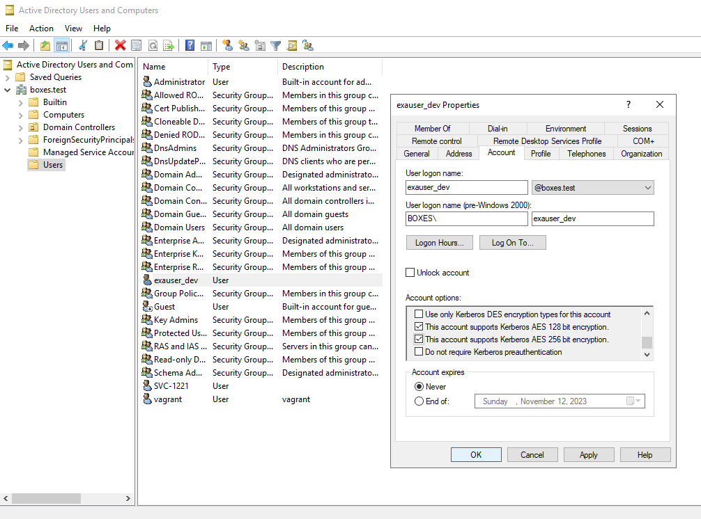
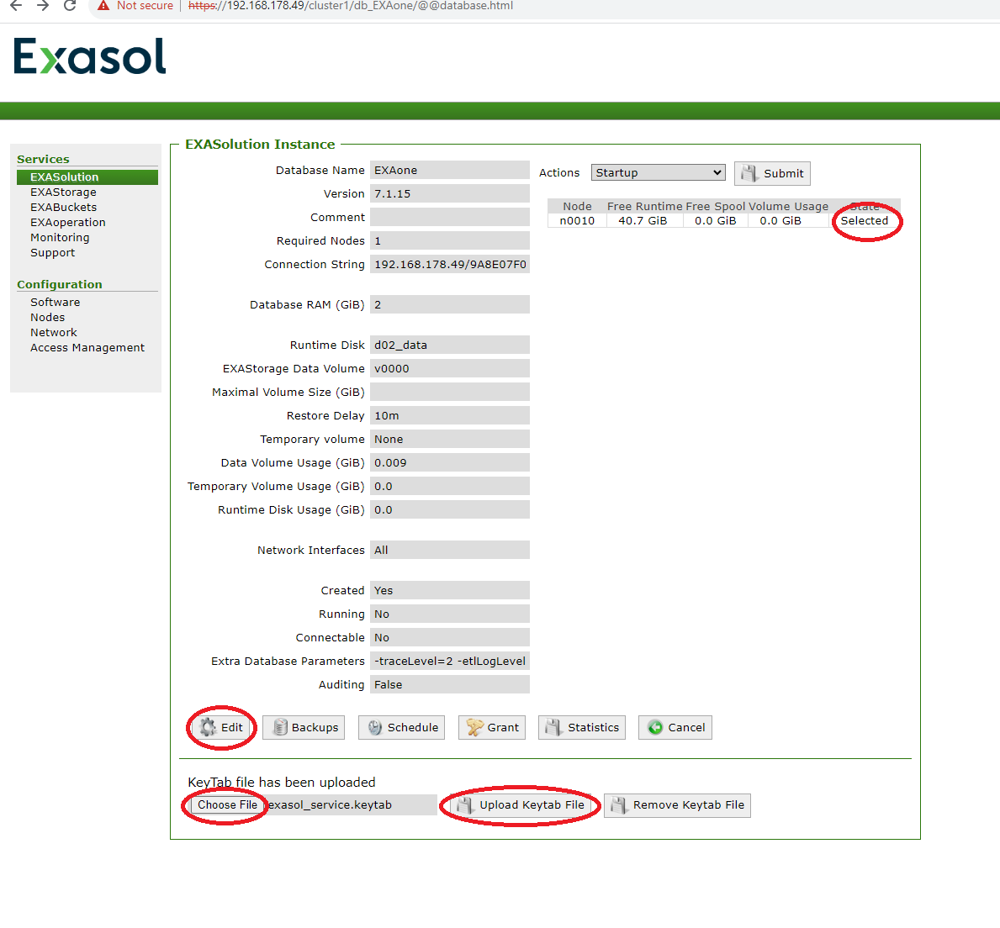
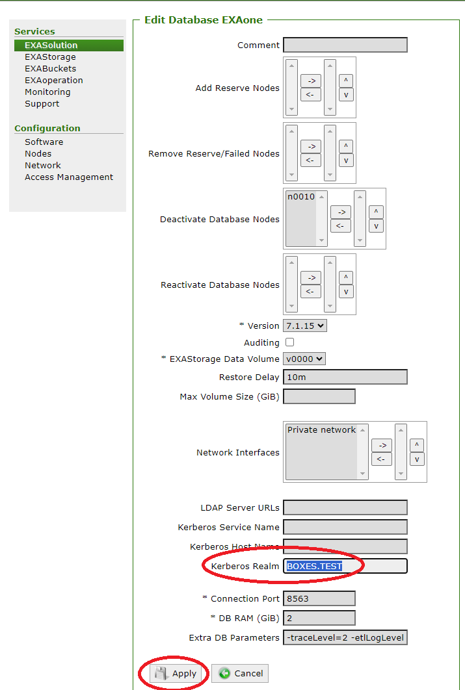
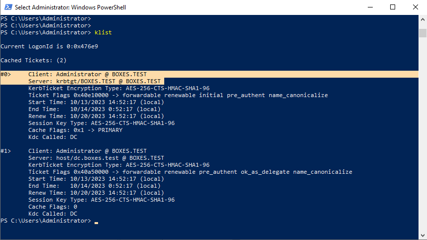

# Setting up Exasol Kerberos single sign-on with Active Directory
## Prerequisites
* AD: installed and configured to authenticate users, domain is configured (which hosts users to be SSO in Exasol DB), admin access to AD
* Exasol DB 7.1: installed and configured, admin access to Exaoperation, dba access to DB
* Client machine: able authenticate with AD (get kerberos tgt for the client user), able to establish connection to Exasol DB, Exaplus installed (https://downloads.exasol.com/clients-and-drivers/exaplus)

## Configuring SSO for ExasolDB
###  1. Create Exasol service account in AD
Create a new user in the AD domain to represent Exasol DB service.

This can be done by following commands in power shell:
```
$password = ConvertTo-SecureString "{Service account password}" -AsPlainText -Force
New-ADUser -Name "{Service account name}" -AccountPassword $password -Enabled $true
```
* **\{Service account name\}**: arbitrary Exasol service user alias  
* **\{Service account password\}**: password for Exasol service user  

**Example**
```
$password = ConvertTo-SecureString "Password123!" -AsPlainText -Force
New-ADUser -Name "exauser_dev" -AccountPassword $password -Enabled $true
```


or in "Active Directory Users and Computers" UI:



***Noctic: service user can have an arbitrary name, it is just an alias for an Exasol service***

###  2. Anable supports AES 128/256 bit encryption for Exasol service user
In "Active Directory Users and Computers" go to previously created Exasol user -> Properties -> Account -> Account options -> check "This account supports AES 128 bit encryption" and "This account supports AES 256 bit encryption" checkboxes.



###  3. Register SPN for exaol service user
In order to register SPN execute following command in power shell: 

```
setspn -S {Exasol service name}/{Exasol host name}.{AD domian} {Service account name}
```

* **\{Exasol service name\}**: this parameter represents a **kerberos service name** of a particular exasol instance. This is the first out of 2 parameters which will be used during user authentication. It is arbitrary now, but later on it will be critical to use the exact value which is set up here.  
* **\{Exasol host name\}**: this parameter represents a **kerberos host name** of a particular exasol instance. This is the second out of 2 parameters which will be used during user authentication. It is arbitrary now, but later on it will be critical to use the exact value which is set up here.  
* **\{AD domian\}**: Active Directory domain of the Exasol service user created during step 1  
* **\{Service account name\}**: Exasol service user created during step 1  

To check that SPN was registered correctly run the following command in power shell:
```
setspn -L {Service account name}
```

**Example**
```
setspn -S exasol/exacluster_dev.boxes.test exauser_dev
```


###  4. Generate keytab file for Exasol service
With help of the following ktpass command generate a keytab for Exasol service which will later be uploaded in Exaopertaion:

```
ktpass -out {Keytab path}\exasol_service.keytab -princ {Exasol service name}/{Exasol host name}.{AD domian}@{Kerberos realm} -mapuser {NETBIOS}\{Service account name} -mapop set -pass {Service account password} -ptype KRB5_NT_PRINCIPAL -crypto all
```
* **\{Keytab path\}**: Arbitrary local directory where keytab file will be created.  
* **\{Exasol service name\}**: Exasol **kerberos service name** which was set in step 3.  
* **\{Exasol host name\}**: Exasol **kerberos host name** which was set in step 3.  
* **\{AD domian\}**: Active Directory domain name of the Exasol service user created during step 1.  
* **\{Kerberos realm\}**: In AD it is usually the domain name written in all capital letters.  
* **\{NETBIOS\}**: Active Directory domain's Netbios (subdomain) name. Can be found in AD domain properties.  
* **\{Service account name\}**: Exasol service user created during step 1.  
* **\{Service account password\}**: Password of the Exasol service user created during step 1.  

**Example**
```
ktpass -out C:\temp\exasol_service.keytab -princ exasol/exacluster_dev.boxes.test@BOXES.TEST -mapuser BOXES\exauser_dev -mapop set -pass Password123! -ptype KRB5_NT_PRINCIPAL -crypto all
```

###  5. Upload service keytab in Exaoperation
* Login to Exaoperation of the Exasol DB instance which you need to be accessible with AD SSO.
* Shutdown the database
  
* Go to the database link and wait until the **State** became **Selected**
* In the keytab section click **Choose file** and select the keytab file generated in step 4.
* Click **Upload keytab file** button.
  
* Then click **Edit** button to go to Edit db page
* Specify the **Kerberos Realm** parameter using Kerberos realm from step 4 and click **Apply**
  
* Startup the database and wait until it goes online
  

###  6. Create database user which should authenticate with Kerberos principal
Now the Exasol cluster is configured to authenticate AD users with help of kerberos tickets, and we should allow some AD users to access the database this way.
Since we are dealing with an SSO solution, once the user is logged in their client machine, a tgt-ticket for a corresponding user principal should be already granted. We can check it using **klist** command on the user's machine.



If for some reason tgt is not there (for example it expired), you can try to request it manually with the help of **kinit** command.

To allow the AD user to authenticate to Exasol db using AD SSO do the following:
* connect to DB as dba
* create a database user which is identified by AD user's kerberos principal:
  ```sql
  create user {db user name} identified by KERBEROS PRINCIPAL '{AD user name}@{Kerberos realm}';
  GRANT CREATE SESSION TO {db user name};
  -- grant all other privileges and roles necessary for this particular user
  ```
  *  **\{db user name\}**: arbitrary Exasol db user name. This username itself is just a representation of AD user, it can be completely different form AD username and will not be directly used during authentication.  
  *  **\{AD user name\}**: username of AD user which we want to allow to access the database.  
  *  **\{Kerberos realm\}**: In AD it is usually the domain name written in all capital letters.  

  **Example**
  ```sql
  create user ad_john_smith identified by KERBEROS PRINCIPAL 'jsmith@BOXES.TEST';
  GRANT CREATE SESSION TO ad_john_smith;
  GRANT select any table TO ad_john_smith;
  ```

###  7. Test database connection from the user's AD account with Exaplus 
Configuration is completed. Now we can test connection to the database from the user's AD account with help of Exaplus.

* Login into the user's machine using user's AD account.
* Make sure that user's credential cache already contains an appropriate tgt-ticket. To do so, use **klist** command and check that the result contains a ticket for the principal **{AD user name}@{Kerberos realm}**.
* Open shell terminal and navigate to Exaplus directory
* First try to connect to Exasol DB using a standard authentication method with username and password. For example use dba user from step 6.
  ```
  ./exaplusx64.exe -c {Full connection string to Exasol db}
  ```
  **Example**

  

* Once connection is established you can be sure that client can access and proceed with testing Kerberos authentication.
* Now add **-k** option to the command. Exaplus will ask you to type **Service name** and **Host** instead of username and password. Use **{Exasol service name}** and **{Exasol host name}** from step 3.

  **Example**

  


